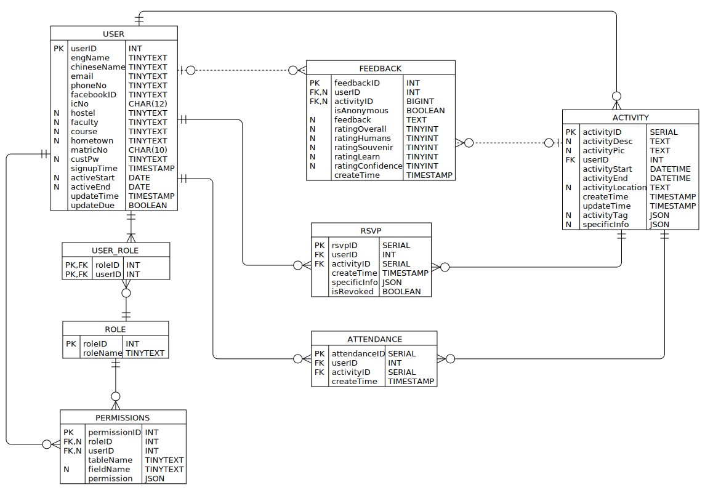

In this document, we will describe the database and tables used in a tabular format. The ER-Diagram is as shown below:



# Database
| Tables        | Description |
|---------------| --- |
| ACTIVITY      | Each entry describes an activity to be participated. 
| ATTENDANCE    | Each entry describes an attendance entry of one and only one user.
| FEEDBACK      | Each entry describes feedback given by users. User may choose to be anonymous.
| PERMISSIONS   | Each entry describes
| ROLE          | Each entry describes assigned roles to users. Users may be given multiple roles.
| RSVP          |
| USER          |
| USER_ROLE     |

# Tables
## USER
| Field       | Type             | Null | Key | Default           | Extra                       | Additional Description |
|-------------|------------------|------|-----|-------------------|-----------------------------| --- |
| userID      | int(10) unsigned | NO   | PRI | NULL              | auto_increment              |
| engName     | tinytext         | NO   |     | NULL              |                             |
| chineseName | tinytext         | NO   |     | NULL              |                             |
| email       | tinytext         | NO   |     | NULL              |                             |
| phoneNo     | tinytext         | NO   |     | NULL              |                             |
| facebookID  | tinytext         | NO   |     | NULL              |                             |
| icNo        | char(12)         | NO   |     | NULL              |                             | IC Number without dashes.
| hostel      | tinytext         | YES  |     | NULL              |                             |
| faculty     | tinytext         | YES  |     | NULL              |                             |
| course      | tinytext         | YES  |     | NULL              |                             |
| hometown    | tinytext         | YES  |     | NULL              |                             |
| matricNo    | char(10)         | NO   |     | NULL              |                             |
| custPw      | tinytext         | YES  |     | NULL              |                             | Will only be filled if user requests a custom password to be set.
| signupTime  | timestamp        | NO   |     | CURRENT_TIMESTAMP |                             |
| activeStart | date             | NO   |     | NULL              |                             |
| activeEnd   | date             | NO   |     | NULL              |                             |
| updateTime  | timestamp        | NO   |     | CURRENT_TIMESTAMP | On update CURRENT_TIMESTAMP |
| updateDue   | tinyint(1)       | NO   |     | NULL              |                             | The admin will decide if user has data waiting to be updated. If yes then toggle this as true.
- For testing usage, fields ```activeStart```, ```activeEnd```, ```updateDue```, ```chineseName``` will be ignored.


## ROLE
| Field    | Type             | Null | Key | Default | Extra          |
|----------|------------------|------|-----|---------|----------------|
| roleID   | int(10) unsigned | NO   | PRI | NULL    | auto_increment |
| roleName | tinytext         | NO   |     | NULL    |                |

## USER_ROLE
| Field            | Type                | Null | Key | Default           | Extra             | 
|------------------|---------------------|------|-----|-------------------|-------------------|
| feedbackID       | int(10) unsigned    | NO   | PRI | NULL              | auto_increment    | 
| userID           | int(10) unsigned    | YES  | MUL | NULL              |                   | 
| activityID       | bigint(20) unsigned | YES  | MUL | NULL              |                   | 
| isAnonymous      | tinyint(1)          | NO   |     | NULL              |                   | 
| feedback         | text                | YES  |     | NULL              |                   | 
| ratingOverall    | tinyint(3) unsigned | YES  |     | NULL              |                   | 
| ratingHumans     | tinyint(3) unsigned | YES  |     | NULL              |                   | 
| ratingSouvenir   | tinyint(3) unsigned | YES  |     | NULL              |                   | 
| ratingLearn      | tinyint(3) unsigned | YES  |     | NULL              |                   | 
| ratingConfidence | tinyint(3) unsigned | YES  |     | NULL              |                   | 
| createTime       | timestamp           | NO   |     | CURRENT_TIMESTAMP | DEFAULT_GENERATED | 

## FEEDBACK
| Field            | Type                | Null | Key | Default           | Extra             |
|------------------|---------------------|------|-----|-------------------|-------------------|
| feedbackID       | int(10) unsigned    | NO   | PRI | NULL              | auto_increment    |
| userID           | int(10) unsigned    | YES  | MUL | NULL              |                   |
| activityID       | bigint(20) unsigned | YES  | MUL | NULL              |                   |
| isAnonymous      | tinyint(1)          | NO   |     | NULL              |                   |
| feedback         | text                | YES  |     | NULL              |                   |
| ratingOverall    | tinyint(3) unsigned | YES  |     | NULL              |                   |
| ratingHumans     | tinyint(3) unsigned | YES  |     | NULL              |                   |
| ratingSouvenir   | tinyint(3) unsigned | YES  |     | NULL              |                   |
| ratingLearn      | tinyint(3) unsigned | YES  |     | NULL              |                   |
| ratingConfidence | tinyint(3) unsigned | YES  |     | NULL              |                   |
| createTime       | timestamp           | NO   |     | CURRENT_TIMESTAMP | DEFAULT_GENERATED |

## RSVP
| Field        | Type                | Null | Key | Default           | Extra             |
|--------------|---------------------|------|-----|-------------------|-------------------|
| rsvpID       | bigint(20) unsigned | NO   | PRI | NULL              | auto_increment    |
| userID       | int(10) unsigned    | NO   | MUL | NULL              |                   |
| activityID   | bigint(20) unsigned | NO   | MUL | NULL              |                   |
| createTime   | timestamp           | NO   |     | CURRENT_TIMESTAMP | DEFAULT_GENERATED |
| specificInfo | json                | NO   |     | NULL              |                   |
| isRevoked    | tinyint(1)          | NO   |     | NULL              |                   |

- 

## ATTENDANCE
|--------------|---------------------|------|-----|-------------------|-------------------|
| Field        | Type                | Null | Key | Default           | Extra             |     
|--------------|---------------------|------|-----|-------------------|-------------------|     
| attendanceID | bigint(20) unsigned | NO   | PRI | NULL              | auto_increment    |
| userID       | int(10) unsigned    | NO   | MUL | NULL              |                   |
| activityID   | bigint(20) unsigned | NO   | MUL | NULL              |                   |
| createTime   | timestamp           | NO   |     | CURRENT_TIMESTAMP | DEFAULT_GENERATED |

## ACTIVITY
| Field            | Type                | Null | Key | Default           | Extra                       |
|------------------|---------------------|------|-----|-------------------|-----------------------------|
| activityID       | bigint(20) unsigned | NO   | PRI | NULL              | auto_increment              |
| activityDesc     | text                | YES  |     | NULL              |                             |
| activityPic      | text                | YES  |     | NULL              |                             |
| userID           | int(10) unsigned    | NO   | MUL | NULL              |                             |
| activityStart    | datetime            | NO   |     | NULL              |                             |
| activityEnd      | datetime            | NO   |     | NULL              |                             |
| activityLocation | text                | YES  |     | NULL              |                             |
| createTime       | timestamp           | NO   |     | CURRENT_TIMESTAMP |                             |
| updateTime       | timestamp           | NO   |     | CURRENT_TIMESTAMP | On update CURRENT_TIMESTAMP |
| activityTag      | json                | YES  |     | NULL              |                             |
| specificInfo     | json                | YES  |     | NULL              |                             |

```activityTag``` is used to determine the type of activity, or the tag that one classifies the activity to be. Current decision is that users can self determine tag values. Future implementations include auto-grouping similar tags together and renaming them accordingly.

The json entry for ```activityTag``` will be as such:
```
[
    "tag1",
    "tag2",
    "tag3",
      .
      .
      .
    "tagN"
]
```

## PERMISSIONS
|--------------|------------------|------|-----|---------|----------------|
| Field        | Type             | Null | Key | Default | Extra          |
|--------------|------------------|------|-----|---------|----------------|
| permissionID | int(10) unsigned | NO   | PRI | NULL    | auto_increment |
| roleID       | int(10) unsigned | YES  | MUL | NULL    |                |
| userID       | int(10) unsigned | YES  | MUL | NULL    |                |
| tableName    | tinytext         | NO   |     | NULL    |                |
| fieldName   | tinytext         | YES  |     | NULL    |                |
| permission   | json             | NO   |     | NULL    |                |

### __PERMISSIONS.permission__
- This field will be a json entry that describes the permission for each role/user and its respective table and fields.
- If there is ```tableName``` but no ```fieldName```, the json entry will be treated as permission description for that table.
- If not defined, all access for that role / user (unless defined by its inherited role) will be denied.

The json entry for fields will be as such:
```
{
    "exist"     : true,
    "read"      : true,
    "create"    : true,
    "modify"    : true,
    "delete"    : true
}
```
Where:

| Field | Description |
| --- | --- |
| exist     | If the role/user is able to know that the table/field exist.
| read      | If the role/user is able to read the contents of the table/field.
| create    | If the role/user is able to create a new entry.
| modify    | If the role/user is able to modify an existing entry.
| delete    | If the role/user is able to delete an existing entry.

---

The json entry for tables will be as such:
```
{
    "exist"     : true,
    "describe"  : true,
    "addField"  : true,
    "modField"  : true,
    "delField"  : true
}
```
Where:

| Field | Description |
| --- | ---     |
| exist         | If the role/user is able to know that the table/field exist.
| describe      | If the role/user is able to see the table description (description of all fields, their types, restrictions etc.)
| addField      | If the role/user is able to add a column (field) to the table.
| modField      | If the role/user is able to modify a column (field) of the table.
| delField      | If the role/user is able to delete a column (field) of the table.
